# RMS Enterprise Deployment & Software Distribution Architecture

| | |
| --- | --- |
| **Status** | Proposed |
| **Version** | 1.0 |
| **Date** | 2026-08-19 |

## 1. Overview

RMS (Robot Management System) is a centralized management platform for a client's robot fleet.

RMS can be deployed in:

- Cloud environments
- Client-owned / on-premises infrastructure

Each client receives an isolated RMS deployment running inside the client's private infrastructure.

The architecture separates:

- VSF software distribution / control plane
- Client deployment / runtime plane
- Application authorization plane

The core architectural principle is:

> VSF distributes software and release artifacts; the client controls deployment; RMS controls access to fleets and robots.

The client infrastructure should not require VSF to have administrative access to the client's Kubernetes cluster.

## 2. Architectural Goals

### 2.1 Security

- Client Kubernetes clusters remain under client control.
- VSF does not require Kubernetes credentials for client clusters.
- Client networks should not require inbound connectivity from VSF.
- Image access must be authorized per client.
- Client A must not be able to pull Client B's images.
- Kubernetes should pull images only from the client's private registry.
- Human users authenticate through the client's IdP.
- RMS performs application-level authorization.
- All credentials follow least privilege.

### 2.2 Deployment isolation

Each client should have independent:

- Argo CD
- Kubernetes cluster
- Private registry
- GitOps configuration
- Registry credentials
- Image authorization
- RMS instance
- Runtime data

A problem in Client A's environment should not directly affect Client B.

### 2.3 Operational requirements

The architecture should support:

- Client-controlled deployment
- Client-specific RMS versions
- Client-specific release approval
- Reproducible deployments
- Rollback
- Auditability
- Offline / on-prem environments
- Centralized VSF software release management

## 3. High-Level Architecture

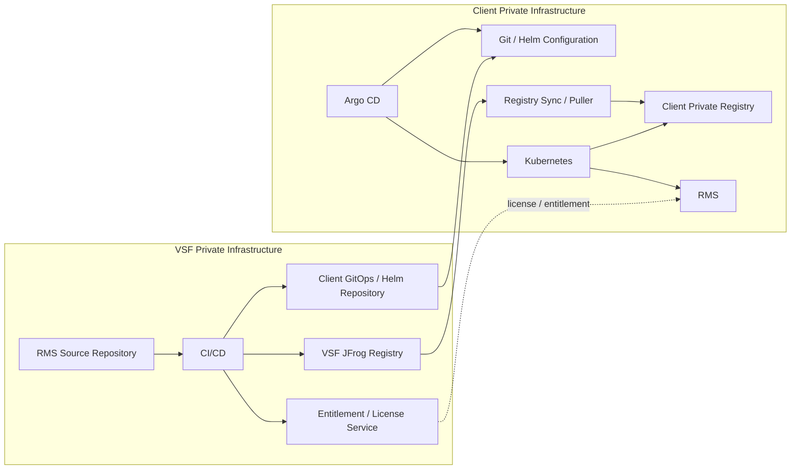

## 4. Trust Boundaries

The architecture contains three major trust boundaries.

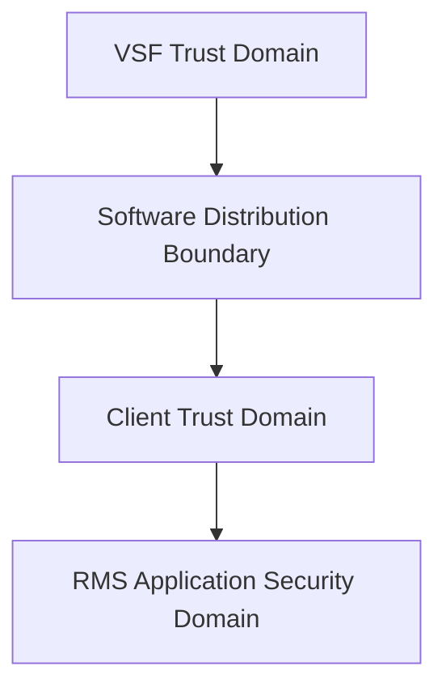

### 4.1 VSF trust domain

VSF controls:

- RMS source code
- CI/CD
- Internal artifacts
- JFrog
- Release promotion
- Client-specific release configuration
- Entitlement / license information

VSF does not control the client's Kubernetes cluster.

### 4.2 Client infrastructure trust domain

The client controls:

- Kubernetes
- Argo CD
- Client registry
- Registry credentials
- Network policy
- Kubernetes RBAC
- Deployment approval
- RMS runtime

VSF should not have administrative access to these resources.

### 4.3 RMS application trust domain

RMS controls:

- Fleet access
- Robot access
- Robot operations
- Application roles
- Resource-level authorization
- Runtime entitlement validation

Kubernetes RBAC should not be used to implement robot / fleet authorization.

## 5. GitOps Architecture

**Decision:** Per-client Argo CD.

Each client runs its own Argo CD.

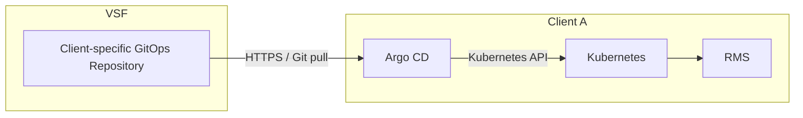

### Rationale

A centralized Argo CD would require VSF to possess credentials capable of controlling client Kubernetes clusters.

That creates this trust relationship:

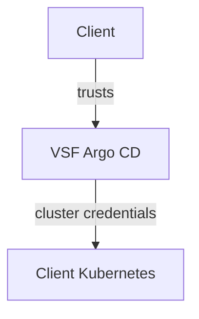

A compromise of VSF's Argo CD or its credentials could therefore become a compromise of the client's infrastructure.

With per-client Argo CD:

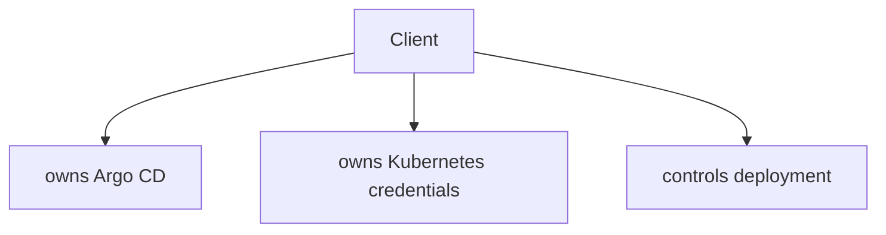

VSF only provides desired state.

This follows the principle:

> The owner of the runtime environment should own the deployment controller.

## 6. GitOps Repository Model

Each client has a dedicated GitOps repository or isolated repository path.

Example:

```text
rms-client-a-gitops
├── base/
│   ├── Chart.yaml
│   └── templates/
│
└── environments/
    └── production/
        ├── values.yaml
        └── release.yaml
```

A stronger separation is:

```text
VSF
├── RMS Helm Chart
└── Client A GitOps Repository
       └── values / deployment configuration
```

The Helm chart contains the product deployment definition.

The client GitOps repository contains environment-specific configuration.

Examples:

```yaml
image:
  repository: client-registry.example.com/rms
  digest: sha256:...

resources:
  requests:
    cpu: ...
    memory: ...

ingress:
  host: rms.client-a.internal
```

## 7. Client-Controlled Deployment

Deployment should be pull-based.

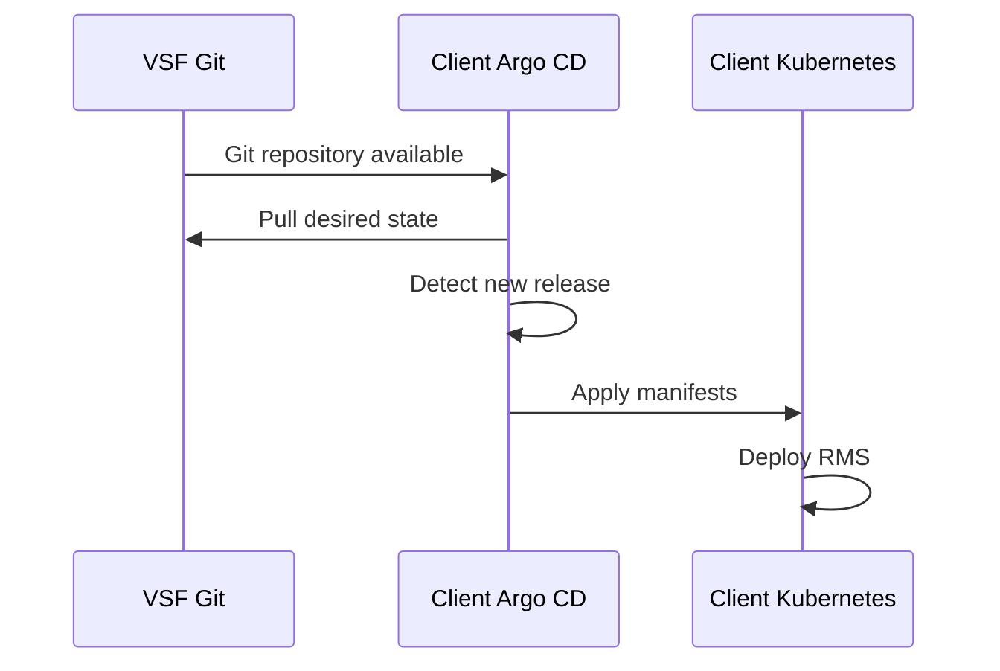

VSF does not directly call:

- Client Kubernetes API

The client can decide:

- automatic deployment
- manual approval
- maintenance window
- rollback

## 8. Image Distribution Architecture

The image distribution path is intentionally different from the Kubernetes deployment path.

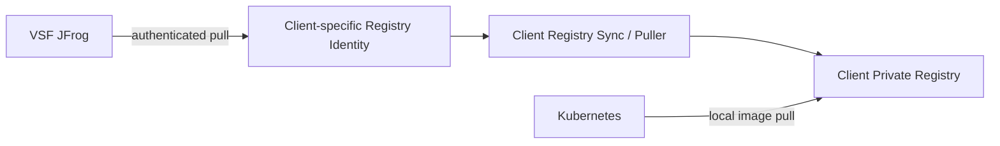

### Important distinction

Kubernetes does not pull from VSF JFrog.

Instead:

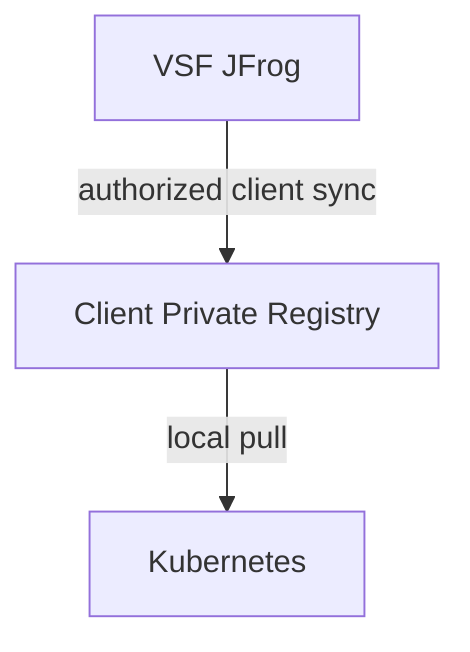

This gives the client a completely local runtime dependency.

## 9. Why Use a Client Private Registry?

The client registry provides several benefits:

### Network isolation

Kubernetes does not need Internet access to VSF JFrog.

### Runtime independence

After an image is synchronized:

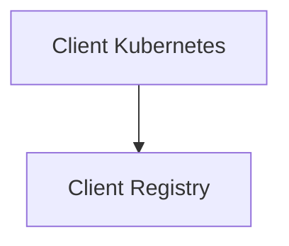

The deployment does not depend on the VSF registry being reachable.

### Security boundary

VSF controls what enters the client environment.

The client controls what happens after the image enters its infrastructure.

### Performance

Large image pulls happen inside the client's network.

## 10. Image Authorization

Image authorization is a first-class security requirement.

Client A must not be able to use Client B's registry credentials to obtain Client B's artifacts.

Recommended model:

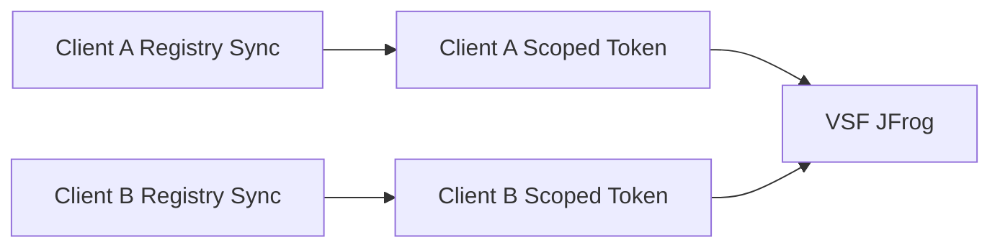

JFrog permissions should be scoped approximately as:

**Client A identity**

```text
READ:    client-a/*
WRITE:   none
DELETE:  none
ADMIN:   none
```

**Client B identity**

```text
READ:    client-b/*
WRITE:   none
DELETE:  none
ADMIN:   none
```

Therefore:

| Request | Result |
| --- | --- |
| Client A → `client-a/rms:1.8.2` | ALLOW |
| Client A → `client-b/rms:1.8.2` | DENY |
| Client A → `internal/*` | DENY |

## 11. Image Credential Separation

There are two independent credential boundaries.

### Credential 1: Client registry synchronization

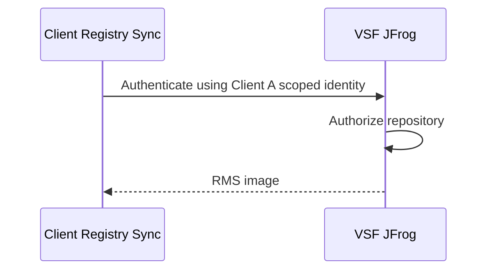

This credential belongs to the client-side synchronization mechanism.

It should be:

- client-specific
- read-only
- scoped
- revocable
- preferably short-lived

### Credential 2: Kubernetes → Client Registry

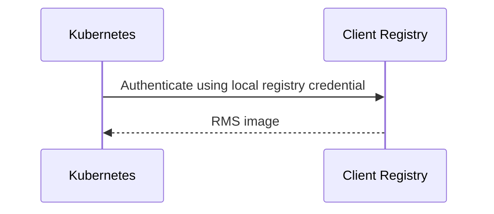

This credential:

- belongs to the client
- stays inside the client environment
- is not shared with VSF
- is unrelated to the VSF JFrog credential

Argo CD does not need the VSF JFrog credential.

Argo CD manages Kubernetes manifests; Kubernetes / kubelet performs the image pull.

## 12. Image Release and Promotion

Do not allow clients to freely consume arbitrary images from the internal VSF registry.

Use a release / promotion process.

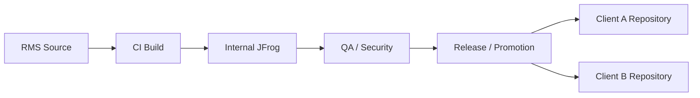

Example:

```text
RMS 1.8.2

Client A: allowed
Client B: allowed
Client C: not allowed
```

Only the entitled client repository receives the artifact.

This provides a second authorization layer:

```text
Registry ACL
+
Release entitlement
```

## 13. Image Version Authorization

Use explicit release promotion.

Avoid:

```yaml
image:
  tag: latest
```

Prefer:

```yaml
image:
  repository: client-registry.example.com/rms
  digest: sha256:abcdef...
```

The client GitOps repository therefore records the exact artifact deployed.

Example:

```text
Client A GitOps

RMS:
    version: 1.8.2
    digest: sha256:abcdef...
```

This provides:

- reproducibility
- rollback
- auditability
- deterministic deployment

## 14. Image Integrity

**Selected decision:** Image digest pinning.

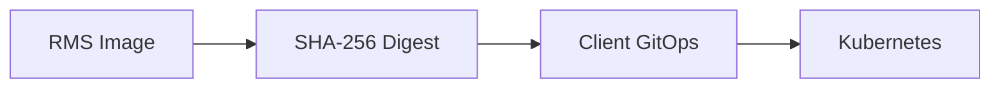

The GitOps configuration references the immutable digest.

For example:

```yaml
image:
  repository: registry.client-a.local/rms
  digest: sha256:abcdef123456...
```

A future enhancement can add image signing and admission verification.

## 15. Network Architecture

The default communication model is client-initiated outbound communication.

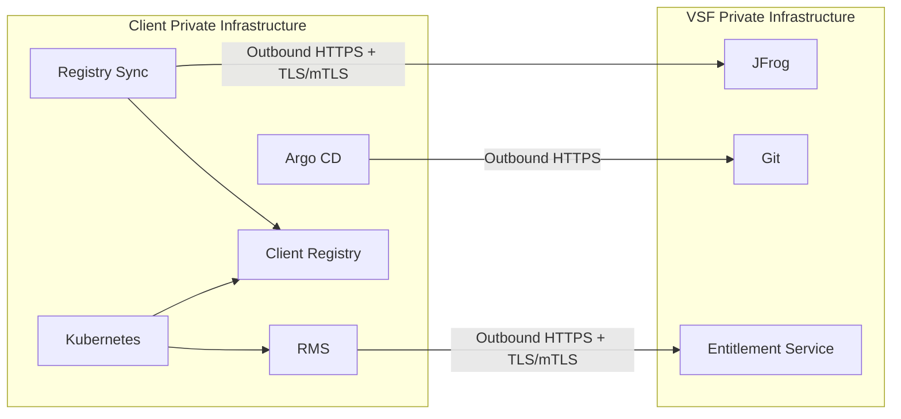

The desired firewall posture is:

| Direction | Policy |
| --- | --- |
| Client → VSF | ALLOW |
| VSF → Client | DENY |

where practical.

## 16. mTLS

For machine-to-machine communication, use TLS with mutual authentication where supported.

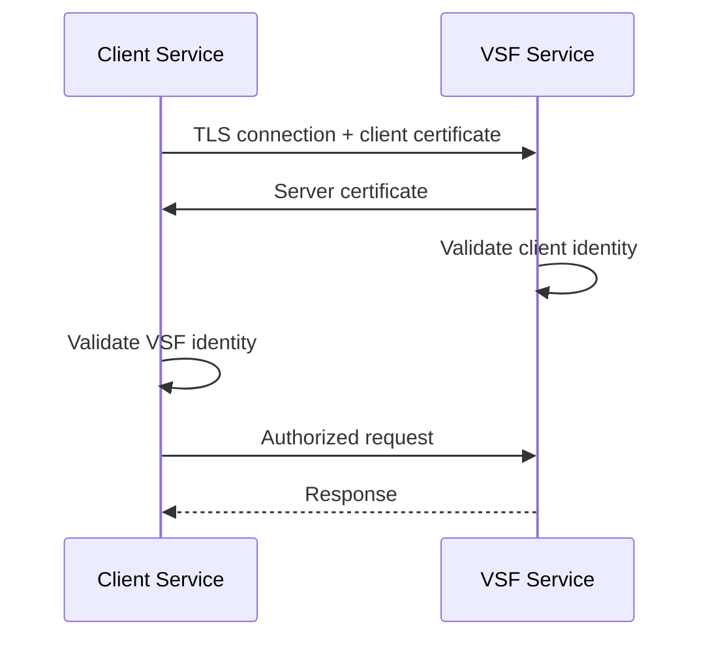

The identity should represent the service, not a human user.

For example:

```text
client-a-registry-sync
```

rather than:

```text
admin@client-a.com
```

## 17. VPN

A VPN is not required by the base architecture.

Default:

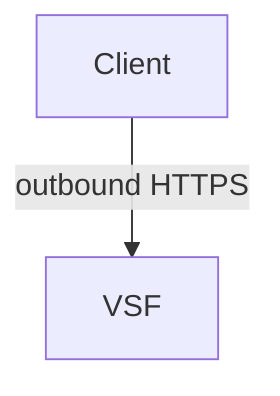

A VPN / private network connection can be supported when required by client IT policy.

However, VPN should not automatically imply that VSF can access:

- Kubernetes API
- SSH
- Node networks
- Internal services

Network connectivity and authorization must remain separate.

## 18. Human Authentication

**Selected decision:** Client's existing IdP.

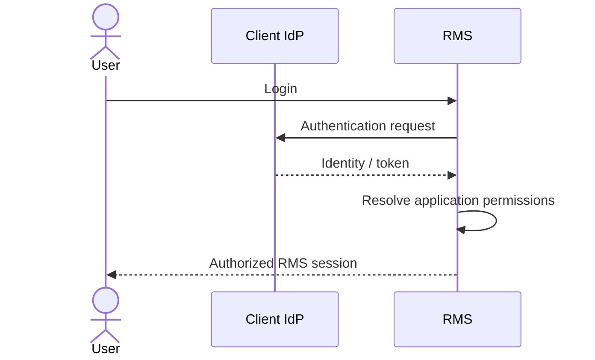

RMS should not need to own the client's user directory.

The client's IdP remains responsible for:

- user identity
- authentication
- MFA
- account lifecycle

RMS remains responsible for:

- roles
- fleet permissions
- robot permissions
- operational permissions

## 19. Application Authorization

Authentication and authorization are separate.

| Concept | Question |
| --- | --- |
| Authentication | Who are you? |
| Authorization | What are you allowed to do? |

Example:

```text
User:  alice@client-a.com
Role:  FleetOperator
Scope: fleet-a
```

Then:

| Request | Result |
| --- | --- |
| `GET /fleets/fleet-a/robots` | ALLOW |
| `GET /fleets/fleet-b/robots` | DENY |
| `POST /robots/robot-123/teleoperation` | depends on operation permission |

## 20. RMS Authorization Model

Recommended model:

```text
RBAC
+
resource-level authorization
```

Conceptually:

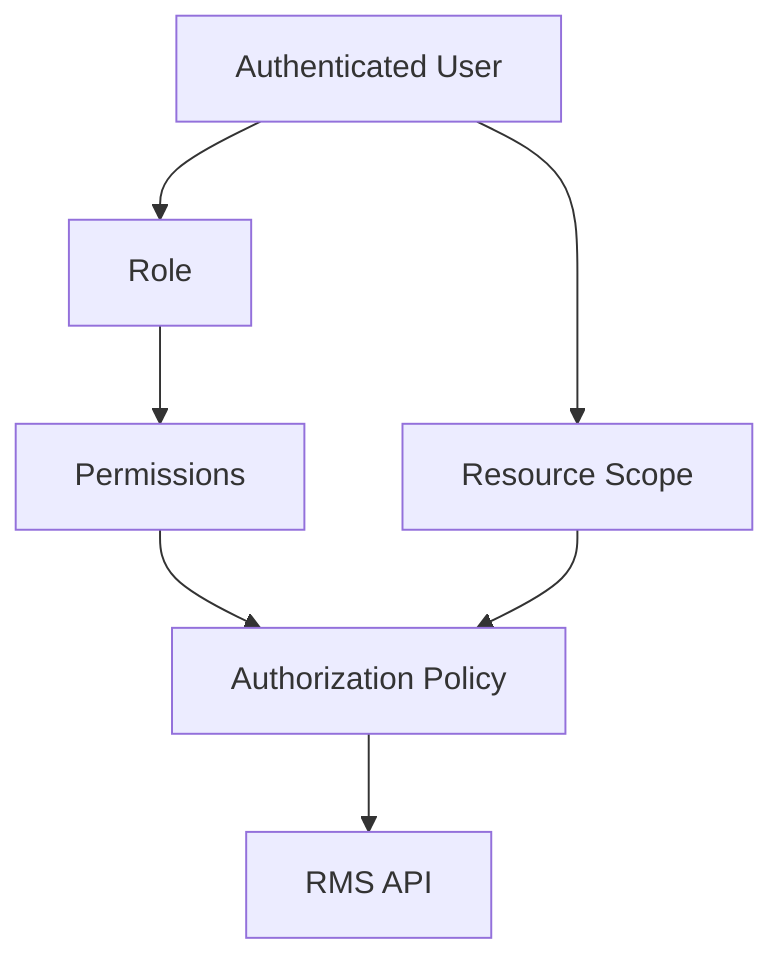

Example:

```text
User
  └── Fleet Operator

Permissions
  ├── fleet.read
  ├── robot.read
  └── robot.teleoperate

Resource scope
  └── fleet-a
```

This should be enforced by RMS.

Kubernetes RBAC should not be used for this purpose.

## 21. VSF Does Not Access Client RMS

**Selected decision:** No direct VSF → Client RMS access.

Therefore:

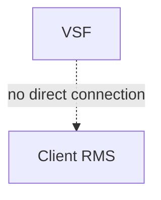

This keeps the architecture simpler and maintains the client's private network boundary.

If centralized monitoring or support is required later, introduce a client-initiated telemetry / control channel rather than exposing the client network to VSF.

## 22. Runtime Entitlement

Registry authorization answers:

> Is this client allowed to download this image?

It does not answer:

> Is this RMS installation authorized to run?

These are different problems.

For environments where software entitlement / licensing matters, use a signed entitlement.

```mermaid
sequenceDiagram
    participant VSF as VSF Entitlement Service
    participant RMS as Client RMS

    RMS->>VSF: Request entitlement
    VSF->>VSF: Validate client
    VSF-->>RMS: Signed entitlement
    RMS->>RMS: Verify signature
    RMS->>RMS: Validate product/version/features
```

For disconnected environments, RMS should be capable of validating a previously issued signed entitlement offline.

## 23. Recommended Entitlement Model

An entitlement can conceptually contain:

```yaml
client_id: client-a
product: rms
edition: enterprise

version:
  min: 1.0
  max: 1.x

features:
  - fleet_management
  - telemetry
  - robot_operations

expires_at: ...
license_id: ...
```

The actual format should be signed cryptographically.

The client RMS only needs the VSF public verification key to validate the signature.

## 24. Complete Deployment Flow

```mermaid
sequenceDiagram
    participant SRC as RMS Source
    participant CI as VSF CI/CD
    participant J as VSF JFrog
    participant G as Client GitOps
    participant S as Client Registry Sync
    participant R as Client Registry
    participant A as Client Argo CD
    participant K as Kubernetes
    participant RMS as RMS

    SRC->>CI: Source change
    CI->>CI: Build and test
    CI->>J: Publish immutable image
    CI->>J: Create release
    CI->>G: Update approved release configuration

    S->>J: Authenticate as client-specific identity
    J->>J: Check client entitlement
    J-->>S: Authorized image
    S->>R: Store image locally

    A->>G: Pull desired state
    A->>K: Apply RMS manifests
    K->>R: Pull image
    R-->>K: RMS image
    K->>RMS: Start RMS

    RMS->>RMS: Validate runtime entitlement
```

## 25. Complete Security Model

```mermaid
flowchart TB
    USER["Client User"]
    IDP["Client IdP"]
    RMS["Client RMS"]

    VSF["VSF"]
    JFROG["VSF JFrog"]
    ENT["Entitlement Service"]

    SYNC["Client Registry Sync"]
    REG["Client Private Registry"]
    ARGO["Client Argo CD"]
    K8S["Client Kubernetes"]

    USER --> IDP
    IDP --> RMS

    SYNC -->|"mTLS + scoped credential"| JFROG
    JFROG -->|"authorized image"| SYNC
    SYNC --> REG

    ARGO -->|"Git pull"| VSF
    ARGO --> K8S
    K8S -->|"local pull"| REG
    K8S --> RMS

    RMS -->|"optional outbound"| ENT
    RMS --> AUTHZ["RMS RBAC + Resource Authorization"]
```

## 26. Credential Ownership

| Credential | Owner | Used by | Target | Scope |
| --- | --- | --- | --- | --- |
| VSF CI credential | VSF | CI/CD | JFrog | Publish images |
| Client JFrog pull credential | Client | Registry Sync | VSF JFrog | Read client artifacts only |
| Client registry credential | Client | Kubernetes | Client Registry | Read required images |
| Git credential | Client / Argo CD | Argo CD | Git repository | Read client GitOps config |
| Kubernetes credential | Client | Argo CD | Client Kubernetes | Required namespaces / resources |
| User identity | Client IdP | User | RMS | Authentication |
| Runtime entitlement | VSF | RMS | Local RMS | Product / version / features |

No credential should cross trust boundaries unnecessarily.

## 27. Failure Scenarios

### VSF JFrog unavailable

Existing client deployments should continue running.

```mermaid
flowchart TB
    R["Client Registry"]
    K["Kubernetes"]
    RMS["RMS"]

    R --> K
    K --> RMS
```

Only new image synchronization is affected.

### VSF Git unavailable

Existing RMS deployment continues running.

Argo CD retains the last successfully synchronized desired state.

### Client loses Internet access

Existing RMS should continue operating if the required runtime dependencies are local.

The client cannot:

- obtain new releases
- synchronize new images
- refresh online entitlement

unless the architecture supports offline release / license mechanisms.

### Client registry unavailable

Kubernetes cannot start a new pod requiring an image not already cached locally.

Existing running containers are generally unaffected until restart / replacement requires the image.

## 28. Rollback

Because images are immutable and GitOps is declarative:

```mermaid
flowchart LR
    subgraph Current["Current"]
        C["RMS"]
        CB["sha256:BBB"]
        C --> CB
    end

    subgraph Rollback["Rollback"]
        R["RMS"]
        RA["sha256:AAA"]
        R --> RA
    end
```

Rollback consists primarily of reverting the GitOps release reference.

## 29. Client Isolation

The architecture should maintain isolation at multiple levels.

```mermaid
flowchart TB
    VSF["VSF"]

    CA["Client A"]
    CB["Client B"]

    GA["Git Repo A"]
    GB["Git Repo B"]

    JA["JFrog ACL A"]
    JB["JFrog ACL B"]

    RA["Registry A"]
    RB["Registry B"]

    KA["K8s A"]
    KB["K8s B"]

    RMSA["RMS A"]
    RMSB["RMS B"]

    VSF --> CA
    VSF --> CB

    CA --> GA --> JA --> RA --> KA --> RMSA
    CB --> GB --> JB --> RB --> KB --> RMSB
```

A Client A identity must never be reusable for Client B.

## 30. Security Principles

The architecture follows these principles:

### Least privilege

Every identity receives only the permissions required for its function.

### Client ownership

The client owns its runtime infrastructure and Kubernetes credentials.

### Pull over push

Client environments initiate software distribution whenever possible.

### No unnecessary inbound connectivity

VSF should not need direct access into client private networks.

### Separation of concerns

```text
Network security
    ≠
Registry authorization
    ≠
Kubernetes authorization
    ≠
RMS authorization
```

### Immutable artifacts

Use image digests rather than mutable tags.

### Explicit promotion

A client receives only explicitly authorized releases.

### Independent credentials

Client A and Client B have completely separate identities and credentials.

### Defense in depth

Image authorization, runtime entitlement, and RMS authorization solve different security problems.

## 31. Final Recommended Architecture Decisions

| # | Decision | Final |
| --- | --- | --- |
| 1 | GitOps controller | Per-client Argo CD |
| 2 | Helm configuration | VSF base chart + client-specific values / GitOps |
| 3 | Image distribution | Client pulls / syncs VSF → Client Registry |
| 4 | Image authorization | Per-client identity + ACL + entitlement / promotion |
| 5 | Image version authorization | Explicitly promoted releases |
| 6 | Communication direction | Client → VSF outbound |
| 7 | Network security | HTTPS + mTLS for service communication |
| 8 | Runtime registry | Client private registry |
| 9 | JFrog credential | Per-client scoped read-only credential |
| 10 | Runtime entitlement | Hybrid online / offline signed entitlement |
| 11 | VSF → Client RMS | No direct access |
| 12 | Human authentication | Client IdP |
| 13 | Application authorization | RMS RBAC + resource-level authorization |
| 14 | Client isolation | Per-client Git + image repository / ACL |
| 15 | Deployment approval | Configurable per client |
| 16 | Image integrity | Immutable image digest |

## 32. Target Architecture

```mermaid
flowchart TB
    subgraph VSF["VSF Private Infrastructure"]
        SRC["RMS Source"]
        CI["CI/CD"]
        INT["Internal JFrog"]
        REL["Release / Promotion"]
        DIST["Client Distribution Repository"]
        GIT["Client GitOps Repository"]
        ENT["Entitlement Service"]

        SRC --> CI
        CI --> INT
        INT --> REL
        REL --> DIST
        REL --> GIT
        REL --> ENT
    end

    subgraph CLIENT["Client Private Infrastructure"]
        SYNC["Registry Sync"]
        REG["Private Registry"]
        ARGO["Argo CD"]
        K8S["Kubernetes"]
        RMS["RMS"]
        IDP["Client IdP"]

        SYNC --> REG
        ARGO --> K8S
        K8S --> REG
        K8S --> RMS
        IDP --> RMS
    end

    DIST --> SYNC
    GIT --> ARGO
    ENT -.-> RMS
```

### Core architectural contract

```text
VSF
 ├── builds RMS
 ├── stores artifacts
 ├── promotes releases
 ├── authorizes client image distribution
 └── issues software entitlements

Client
 ├── owns Argo CD
 ├── owns Kubernetes
 ├── owns private registry
 ├── controls deployment
 ├── controls deployment approval
 └── owns network / security policy

RMS
 ├── authenticates users through Client IdP
 ├── authorizes users against fleets / robots
 └── validates runtime entitlement
```

The resulting architecture has a clean trust model:

```mermaid
flowchart LR
    subgraph ST["SOFTWARE TRUST"]
        VSF["VSF"] --> C1["Client"]
    end

    subgraph DT["DEPLOYMENT TRUST"]
        C2["Client"] --> C3["Client"]
    end

    subgraph AT["APPLICATION TRUST"]
        U["User"] --> RMS["RMS"]
    end
```

Most importantly, VSF never needs Kubernetes administrator credentials for the client's cluster, and a client's registry synchronization credential is scoped so it cannot retrieve arbitrary VSF images.
