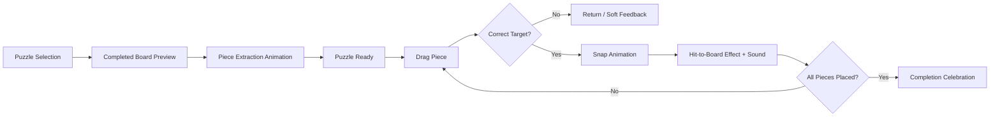
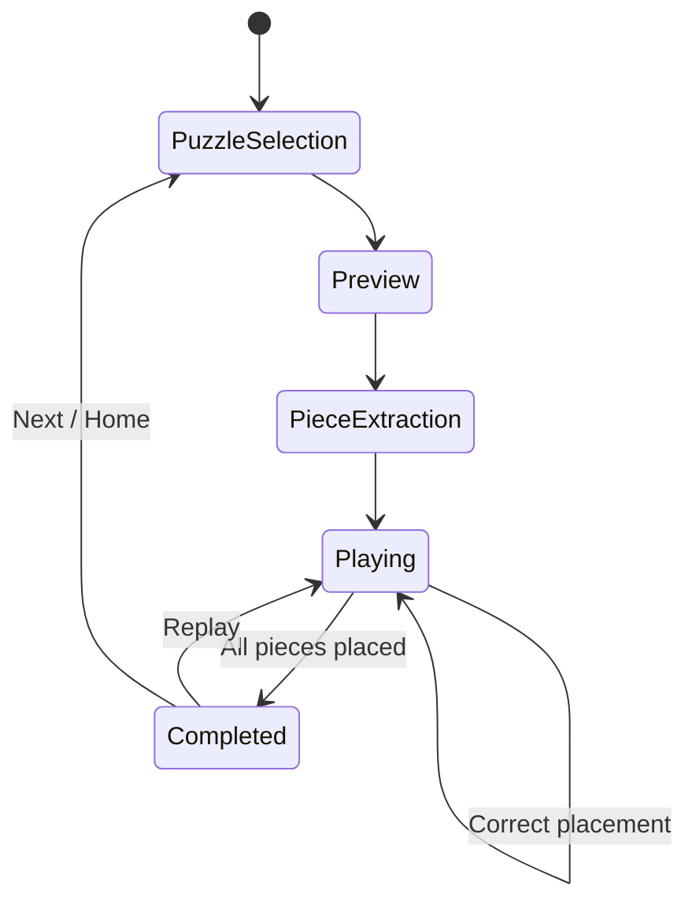
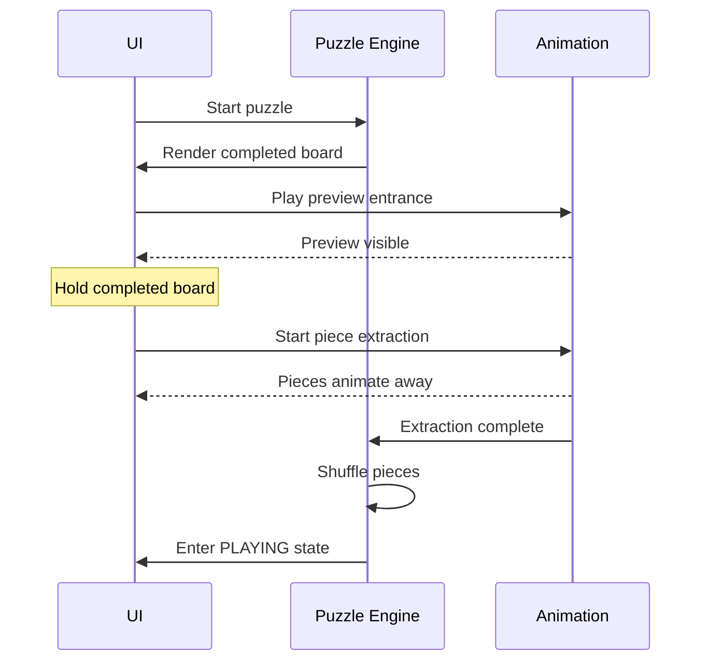
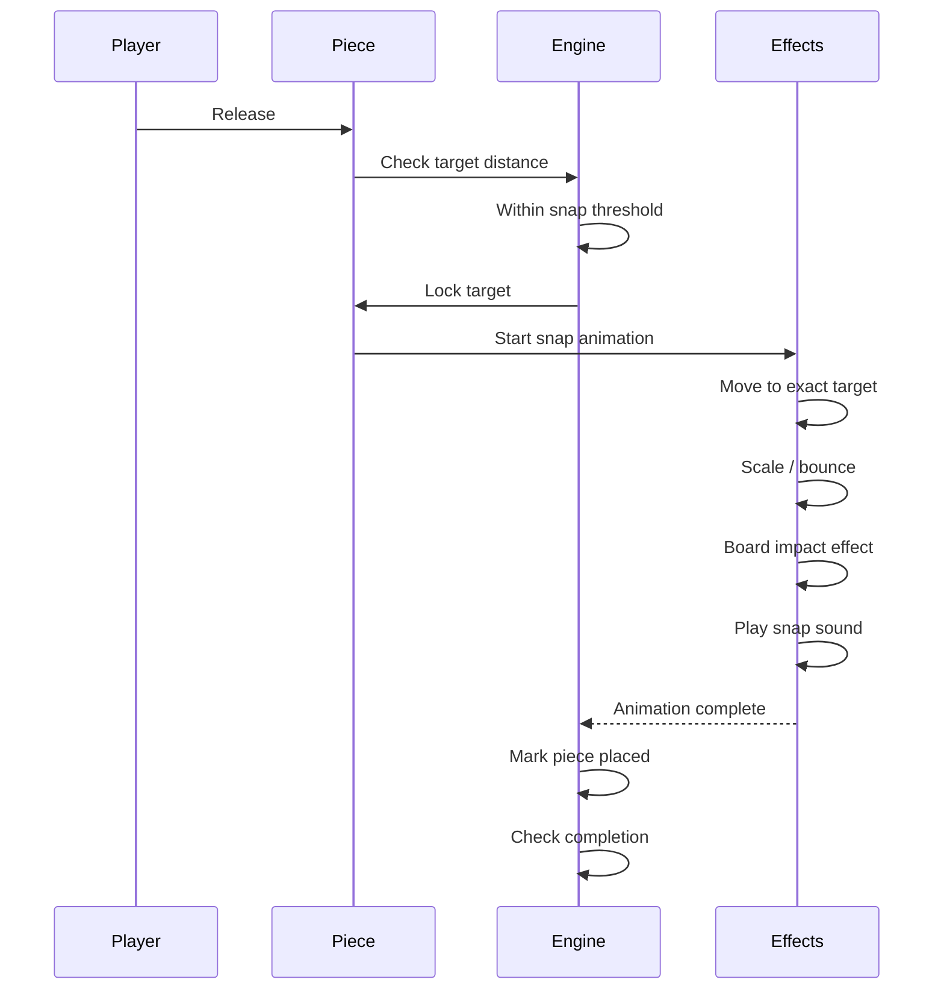

# Software Requirements Specification (SRS)

## 1. Product Overview

### 1.1 Product

A polished, child-friendly digital jigsaw puzzle game.

The player selects a puzzle, sees the **completed puzzle image on the board**, then watches the pieces animate out of the completed board before solving the puzzle.

The core experience is:



The product should feel **cute, polished, responsive, and forgiving**, rather than like a traditional desktop puzzle application.

---

# 2. Goals

## 2.1 Primary Goals

1. Provide an intuitive jigsaw experience for children.
2. Make piece dragging feel immediate and tactile.
3. Make correct placement visually satisfying.
4. Clearly communicate successful placement through animation and sound.
5. Reduce frustration through forgiving snapping.
6. Establish a reusable puzzle engine where new puzzle images can be added without changing gameplay code.
7. Support multiple puzzle difficulties.
8. Work well on touch devices and pointer/mouse devices.
9. Keep the core gameplay functional without network connectivity.

## 2.2 UX Goals

The experience should communicate:

* "This is my puzzle."
* "This piece belongs here."
* "I placed it correctly."
* "I am making progress."
* "I finished it."

The player should not need to read instructions to understand the basic interaction.

---

# 3. Target Users

Primary audience:

* Children approximately 4–8 years old.

Secondary user:

* Parent or guardian who selects or configures puzzles.

The UI should therefore prioritize:

* large interactive targets
* clear visual hierarchy
* minimal text
* recognizable icons
* friendly animation
* forgiving interaction
* no destructive failure states

---

# 4. Product Scope

## 4.1 MVP Features

### Puzzle Library

* Display available puzzles.
* Display puzzle preview artwork.
* Display puzzle difficulty.
* Allow the player to select a puzzle.
* Support unlocked/locked puzzle states if progression is enabled.

### Puzzle Preview

When a puzzle starts:

1. Display the completed puzzle on the board.
2. Allow the child to visually inspect the complete image.
3. Hold the completed state for a short configurable duration.
4. Animate puzzle pieces being removed from the board.
5. Transition into the playable state.

### Puzzle Gameplay

* Display all puzzle pieces.
* Randomize piece positions.
* Allow dragging pieces.
* Highlight the currently selected piece.
* Detect proximity to the correct target.
* Snap correctly positioned pieces into place.
* Lock placed pieces.
* Provide visual and audio feedback.
* Detect puzzle completion.

### Completion

* Play a completion animation.
* Provide positive visual/audio feedback.
* Display replay and next-puzzle actions.
* Persist basic completion state.

---

# 5. Out of Scope for MVP

The following should not be implemented unless product requirements change:

* multiplayer
* user accounts
* online synchronization
* leaderboards
* social sharing
* advertisements
* purchases
* procedural puzzle generation
* realistic physics
* piece rotation
* competitive scoring
* complex parental analytics
* backend-dependent gameplay

---

# 6. User Experience

## 6.1 High-Level Game Flow



---

# 7. Puzzle Selection

## 7.1 Requirements

The puzzle selection screen SHALL:

* display available puzzles as large visual cards
* prioritize artwork over text
* support touch interaction
* provide clear selected/pressed states
* avoid small controls

Example:

```text
┌─────────────────────────────────────────┐
│                                         │
│               🧩 PUZZLES                │
│                                         │
│      ┌───────┐   ┌───────┐   ┌───────┐ │
│      │ 🦁    │   │ 🦕    │   │ 🚀    │ │
│      │       │   │       │   │       │ │
│      └───────┘   └───────┘   └───────┘ │
│                                         │
└─────────────────────────────────────────┘
```

The UI should avoid requiring the child to read the puzzle name.

---

# 8. Completed Board Preview

This is a key part of the product experience.

When the child starts a puzzle, the board SHALL initially display the **fully assembled image**.

## 8.1 Preview Sequence



## 8.2 Preview Duration

The completed image SHOULD remain visible long enough for the child to understand the puzzle.

Initial target:

* approximately 2–3 seconds

This value SHOULD be configurable.

## 8.3 Preview Presentation

The board should feel visually complete.

Recommended effects:

* subtle board entrance animation
* gentle scale/opacity transition
* slight ambient movement
* no distracting effects before gameplay starts

---

# 9. Piece Extraction Animation

After the preview period, pieces SHALL visually separate from the completed board.

The animation should make it obvious that:

> "The puzzle is now being taken apart."

The extraction SHOULD NOT simply hide the pieces.

## 9.1 Expected Sequence

```text
Completed Puzzle
       │
       ▼
Small pause
       │
       ▼
Pieces visually separate
       │
       ├── slight lift
       ├── scale/rotation
       ├── movement outward
       └── fade/transition
       │
       ▼
Pieces reposition around board
       │
       ▼
Gameplay starts
```

## 9.2 Requirements

The animation SHALL:

* preserve visual continuity between the completed board and pieces
* make the transformation understandable
* avoid making the child wait unnecessarily
* finish before gameplay input is enabled

During extraction:

* puzzle pieces SHALL NOT be draggable
* gameplay actions SHALL be ignored
* completion logic SHALL be disabled

---

# 10. Gameplay Board

The board SHALL provide a clear visual distinction between:

1. available pieces
2. empty puzzle targets
3. correctly placed pieces

The target board MAY show subtle piece outlines or silhouettes.

Example:

```text
┌───────────────────────────────┐
│                               │
│      ┌───┬───┬───┐            │
│      │   │   │   │            │
│      ├───┼───┼───┤            │
│      │   │   │   │            │
│      ├───┼───┼───┤            │
│      │   │   │   │            │
│      └───┴───┴───┘            │
│                               │
│  🧩     🧩        🧩          │
│      🧩       🧩              │
└───────────────────────────────┘
```

The exact visual style should be polished rather than resembling a debugging grid.

---

# 11. Piece Interaction

## 11.1 Dragging

A child SHALL be able to:

1. press/touch a piece
2. move the piece
3. release the piece

The piece SHALL follow the pointer/touch with minimal perceived latency.

The drag loop SHOULD remain entirely local:

```text
Input
  ↓
Pointer/Touch Handler
  ↓
Piece Position
  ↓
Renderer
```

No network operation SHALL occur during dragging.

## 11.2 Selected Piece

While dragging:

* piece SHOULD visually rise above other pieces
* piece MAY slightly scale up
* piece MAY cast a stronger shadow
* z-index/layer SHOULD move above other pieces

Example:

```text
Normal:
     🧩

Dragging:
       🧩
      ↑
   elevated
```

The effect should communicate physical pickup without becoming exaggerated.

---

# 12. Placement Detection

Each piece SHALL have a known target position.

When released, the puzzle engine SHALL calculate the distance between:

* current piece position
* target position

Example:

```typescript
const distance = Math.hypot(
  piece.x - target.x,
  piece.y - target.y
);

if (distance <= snapThreshold) {
  snapPiece(piece);
}
```

## 12.1 Snap Threshold

The threshold SHALL be forgiving enough for children.

It SHOULD be configurable based on:

* board dimensions
* piece size
* difficulty
* device resolution

The threshold should not be a single hard-coded pixel value across all devices.

A proportional model is preferable:

```typescript
const snapThreshold = piece.width * 0.35;
```

The exact value should be tuned through playtesting.

---

# 13. Incorrect Placement

Incorrect placement SHALL NOT create a harsh failure state.

Recommended behavior:

```text
Drop
 ↓
Incorrect
 ↓
Small "soft" feedback
 ↓
Piece returns to previous/free position
```

The piece SHOULD NOT:

* flash red aggressively
* play a failure sound
* shake excessively
* punish the player
* block further interaction

A subtle bounce-back or gentle repositioning is preferred.

---

# 14. Correct Snap Experience

Correct placement is a primary delight moment and SHOULD receive significantly more attention than incorrect placement.

## 14.1 Snap Sequence

Recommended sequence:



## 14.2 Snap Animation

The piece SHOULD:

1. move quickly toward the exact target
2. slightly overshoot or compress
3. settle into position
4. create a small impact/bounce
5. visually merge with the board

A useful animation model:

```text
dragged position
      ↓
fast movement to target
      ↓
small overshoot
      ↓
settle
```

Avoid a slow linear transition. It will feel disconnected from the user's action.

---

# 15. Hit-to-Board Effect

The snap SHALL include a clear **hit-to-board** visual effect.

The purpose is to communicate:

> "This piece belongs here."

Possible effects:

* subtle board ripple
* small impact ring
* short particle burst
* tiny scale pulse on neighboring board area
* piece shadow compression
* brief highlight around the connection

The effect SHOULD originate from the piece's final target position.

Example:

```text
             🧩
              ↓
        ┌───────────┐
        │   target  │
        │    ✦      │
        └───────────┘
           ╲  │  ╱
            ╲ │ ╱
             ✨
```

The effect SHOULD be short enough that repeated placements do not become annoying.

---

# 16. Snap Sound

Every successful placement SHOULD play a short tactile sound.

Sound characteristics:

* short
* bright
* pleasant
* clearly different from failure feedback
* low enough to avoid becoming tiring

The sound SHALL be triggered by successful placement rather than merely by pointer release.

Incorrect placement SHOULD either use no sound or an extremely subtle feedback sound.

Audio SHOULD NOT block gameplay.

---

# 17. Audio Requirements

The system SHOULD support:

* snap sound
* completion sound
* optional background music
* optional UI interaction sounds

Settings SHOULD allow audio to be disabled.

Audio playback failures SHALL NOT break gameplay.

For example:

```typescript
try {
  await audio.play("piece-snap");
} catch {
  // Audio failure must not affect puzzle state.
}
```

Game state must remain authoritative.

---

# 18. Puzzle State Model

The puzzle engine SHOULD have an explicit state machine.

Example:

```typescript
type PuzzlePhase =
  | "preview"
  | "extracting"
  | "playing"
  | "completed";
```

Each piece SHOULD have independent state:

```typescript
type PieceState = {
  id: string;
  targetX: number;
  targetY: number;
  x: number;
  y: number;
  placed: boolean;
  dragging: boolean;
};
```

The overall puzzle state SHOULD conceptually be:

```text
PuzzleState
├── phase
├── puzzle definition
├── pieces[]
├── selectedPieceId
├── placedPieceCount
├── hintsUsed
└── startedAt
```

The UI should render from this state rather than independently deciding whether a puzzle is complete.

---

# 19. Puzzle Generation

A puzzle definition SHOULD be independent from the current game session.

Conceptually:

```typescript
type PuzzleDefinition = {
  id: string;
  image: string;
  rows: number;
  columns: number;
  difficulty: "easy" | "medium" | "hard";
};
```

A runtime session derives pieces from the definition:

```text
PuzzleDefinition
       ↓
Image dimensions
       ↓
Grid
       ↓
Piece definitions
       ↓
Target coordinates
       ↓
Initial positions
       ↓
Game session
```

Adding a new puzzle should primarily require adding an asset and metadata.

---

# 20. Difficulty

MVP difficulty SHALL primarily be controlled by piece count.

Suggested initial levels:

| Difficulty | Pieces |
| ---------- | -----: |
| Easy       |      4 |
| Medium     |      9 |
| Hard       |     16 |

Future levels may support:

* 25 pieces
* 36 pieces
* 49 pieces
* irregular piece shapes
* hidden reference image
* piece rotation

These are outside MVP.

---

# 21. Completion Detection

A puzzle SHALL be considered complete when every piece is locked into its correct target.

The preferred check is state-based:

```typescript
const completed =
  pieces.length > 0 &&
  pieces.every(piece => piece.placed);
```

The system SHOULD NOT rely on:

* counting pointer events
* animation callbacks alone
* number of drag operations

Animation completion and game-state completion should remain separate concerns.

---

# 22. Completion Experience

When the final piece is placed:

```text
Final piece
    ↓
Snap animation
    ↓
Hit-to-board effect
    ↓
Short pause
    ↓
Completion celebration
```

The final placement SHOULD feel slightly more special than normal placements.

Possible effects:

* board-wide glow
* confetti/particles
* character reaction
* completion sound
* gentle celebratory animation

The celebration SHOULD remain appropriate for children and not overwhelm the puzzle artwork.

---

# 23. Navigation After Completion

The completion screen SHOULD provide:

```text
        🎉

    Puzzle Complete!

    [ Replay ]

    [ Next Puzzle ]

    [ Home ]
```

The primary action should be visually obvious.

If there is no next puzzle:

```text
    [ Replay ]

    [ Choose Another ]
```

---

# 24. Progress Persistence

MVP progress MAY persist locally.

Minimum progress model:

```typescript
type PuzzleProgress = {
  puzzleId: string;
  completed: boolean;
  completedCount: number;
};
```

Progress persistence SHALL NOT be required for the core gameplay loop.

If persistence fails, the child should still be able to play.

---

# 25. Responsive Layout

The game SHOULD support:

* phone
* tablet
* desktop browser

Tablet/touch should be considered the primary experience.

The board SHOULD maintain its intended aspect ratio.

Piece coordinates SHOULD be represented in board-relative coordinates rather than hard-coded screen coordinates.

For example:

```typescript
type BoardPosition = {
  x: number; // normalized or board-local
  y: number;
};
```

This prevents puzzle behavior from changing when the viewport changes.

---

# 26. Interaction Constraints

The game SHALL:

* prevent dragging multiple pieces simultaneously
* prevent dragging already placed pieces
* prevent input during preview/extraction
* prevent accidental navigation during drag
* maintain the selected piece above other pieces
* cleanly terminate a drag if the pointer/touch leaves the board

A piece should never remain permanently "dragging" because a pointer-up event was lost.

---

# 27. Performance Requirements

The core drag interaction SHALL target smooth rendering.

Requirements:

* no network calls during dragging
* no expensive image processing on every pointer movement
* no unnecessary global state updates
* avoid allocating large temporary objects inside high-frequency pointer handlers
* pre-load puzzle assets before gameplay
* pre-load important audio assets where practical

The game should remain responsive with at least **16 pieces** in the MVP.

The architecture SHOULD not prevent future support for approximately 50–64 pieces.

---

# 28. Asset Requirements

Each puzzle requires:

* source image
* puzzle metadata
* optional preview thumbnail

Optional:

* completion artwork
* puzzle-specific sounds
* decorative UI assets

Assets SHOULD be loaded before the puzzle enters the playable state.

Gameplay should not begin while required visual assets are still loading.

---

# 29. Error Handling

Failures should degrade gracefully.

### Image loading failure

Show a recoverable error state rather than a broken board.

### Audio failure

Continue gameplay without audio.

### Persistence failure

Continue gameplay and treat progress as temporarily unavailable.

### Interrupted drag

Restore the piece to a valid position.

### Application resize during gameplay

Recalculate rendering coordinates without corrupting piece state.

---

# 30. Accessibility / Parent Controls

MVP should include:

* sound on/off
* music on/off if music exists
* sufficient contrast between pieces and board
* large touch targets
* no critical information conveyed only through sound

Future versions may add:

* reduced-motion mode
* larger pieces
* high-contrast mode
* accessibility-focused difficulty settings

---

# 31. Analytics

Analytics are not required for the core MVP.

If analytics are introduced, useful events include:

```text
puzzle_started
puzzle_completed
piece_placed
piece_misplaced
hint_used
puzzle_replayed
```

Avoid collecting unnecessary child-identifying information.

Analytics should never sit on the critical gameplay path.

---

# 32. Non-Functional UX Requirements

The product SHOULD feel:

* polished
* playful
* predictable
* responsive
* forgiving
* visually coherent

Animation should support interaction rather than become decoration.

Particularly important:

> A child should always understand what just happened.

For every interaction, there should be a clear visual result.

---

# 33. MVP Acceptance Criteria

A puzzle is considered playable when:

* [ ] Child can select a puzzle without reading instructions.
* [ ] Completed puzzle image appears before gameplay.
* [ ] Completed image remains visible for the configured preview duration.
* [ ] Pieces visibly extract from the completed board.
* [ ] Pieces become interactive only after extraction finishes.
* [ ] Child can drag pieces with touch/pointer input.
* [ ] Dragged piece appears above other pieces.
* [ ] Correct placement is detected using a forgiving threshold.
* [ ] Correct piece snaps to its exact target.
* [ ] Snap includes a polished animation.
* [ ] Snap produces a clear board-impact/hit effect.
* [ ] Successful placement plays a short sound when audio is enabled.
* [ ] Correctly placed pieces become locked.
* [ ] Incorrect placement does not create a punitive experience.
* [ ] Final piece triggers completion detection.
* [ ] Completion produces a distinct celebration.
* [ ] Child can replay the puzzle.
* [ ] Child can select another puzzle.
* [ ] Basic completion progress can persist locally.
* [ ] Gameplay remains functional when audio or persistence fails.
* [ ] Resizing the viewport does not corrupt puzzle state.

---

# 34. Recommended MVP Product Boundary

The first implementation should focus on this exact loop:

```text
                    ┌─────────────────┐
                    │ Puzzle Library  │
                    └────────┬────────┘
                             │
                             ▼
                    ┌─────────────────┐
                    │ Complete Image  │
                    │    Preview      │
                    └────────┬────────┘
                             │
                         2–3 sec
                             │
                             ▼
                    ┌─────────────────┐
                    │ Piece Extraction│
                    │    Animation    │
                    └────────┬────────┘
                             │
                             ▼
                    ┌─────────────────┐
                    │   PLAYING       │
                    │                 │
                    │ Drag → Drop     │
                    │      ↓          │
                    │   Snap/Return   │
                    │      ↓          │
                    │  Hit + Sound    │
                    └────────┬────────┘
                             │
                         all placed
                             │
                             ▼
                    ┌─────────────────┐
                    │   Celebration   │
                    │                 │
                    │ Replay / Next   │
                    └─────────────────┘
```

The **highest-priority engineering problem** is not the puzzle catalog or navigation. It is making the **piece interaction loop** feel excellent:

**pick up → drag → release → detect → snap → hit effect → sound → lock**

That loop should be architected independently from the surrounding UI so it can be tuned heavily without rewriting the rest of the application.
